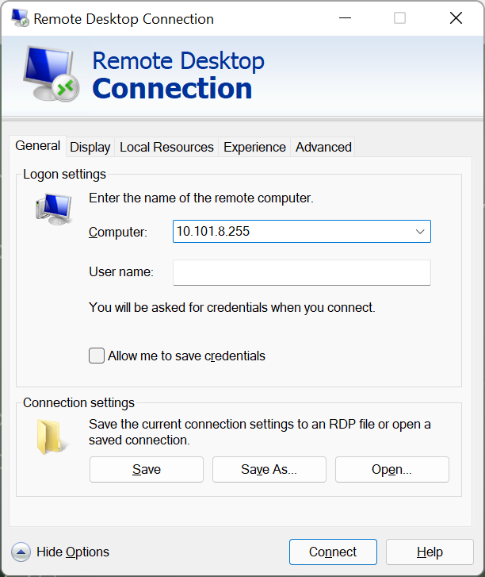

## ECT Lab Introduction - Connect to your GNS3 VM

### Goals
-   Configure Remote Desktop to connect to the lab environment
-   Learn the basic setup of the GNS3 virtual lab environment
-   Overview of Windows and Unix operating systems
-   Introduction to the CLI, and the interaction with filesystems
-   Become familiar with the Linux command line terminal (bash shell)

### Pre-Lab
- Homework/Labs/Projects will often have associated ECT Tech Nuggets that are recommended viewing after reading the lab the first time but before starting the work on the lab.  Do **NOT** follow along with the ECT Tech Nuggets while watching them for the first time. Watch the video and use what you have learned. - Windows is the only OS that is officially supported, but other OS's may be possible. 
<br>
- Watch the the following [ECT Tech Nuggets](https://www.youtube.com/@ecttechnuggets9126/featured) videos on YouTube:
    - GNS3 Introduction - [ECT Tech Nugget N1.1 GNS3]
    - [ECT Tech Nugget - N34.0 - Technology Perspective](https://youtu.be/ixrzbdUu8yQ)
    - Remote Desktop Connection
        - Windows Users: [ECT Tech Nugget N14.1 RDC Connections](https://youtu.be/H52fC9hCmdk)
        - Apple Users: [ECT Tech Nugget N17.0 RDC and RD Gateway Apple Mac OSX](https://youtu.be/g1oYzEham8c)
        - RD Gateway IP/Hostname: ```its-s15.its.ohio.edu```

### Resources

- Personal Computer (Destkop or Laptop)
- A document you have created to use as a lab notebook
- Assigned gHost (GNS3 Virtual Machine)
- [ECT/ITS Lab Notebook Cheatsheet](https://github.com/OHIO-ECT/Lab-Notebook-Cheat-Sheet)
- Additional [ECT Tech Nuggets](https://www.youtube.com/@ecttechnuggets9126/featured):
  - [ECT Tech Nugget N0.1 Basic Diagnostic Tools 1](https://youtu.be/_pRXauSnU6U)
  - [ECT Tech Nugget N0.2 Basic Diagnostic Tools 2](https://youtu.be/hWeJlNVaUbU)
  - [ECT Tech Nugget N0.3 Basic Diagnostic Tools 3](https://youtu.be/PMk53TngTio)
  - [ECT Tech Nugget N0.4 Basic Diagnostic Tools 4](https://youtu.be/gD-Tk1Bk7x0)
  - [ECT Tech Nugget N0.5 Basic Diagnostic Tools 5](https://youtu.be/QTIbS9wyfag)
  - [ECT Tech Nugget N11.0 NMCLI](https://youtu.be/43F51qVz9Ds)

### Network Diagram


### Toolkit

-   Shells (i.e. Powershell, Bash)
-   SSH (i.e. Secure Shell)
-   Commands to be typed by the student and output from shells are indicated within this document in the ``fixed width font Courier New`` (as shown here).
-   Varibles to be filled in by the student are presented in ``<brackets>``. The student will need to replace the <> and the text with the needed varible. Example: **My name is ``<Name>``**. Would change to **My name is Bob.**
-   Find a Print Screen / Screen Capture tool that you like. The following is a list of tools known to work:
    -   Lightshot <https://app.prntscr.com>
    -   Greenshot <https://getgreenshot.org>

### Task 1 - Connect to your GNS3 VM

Each student has been issued their own Linux Ubuntu Desktop Virtual Machine (VM) with GNS3 installed upon it.  This system will be referred to as the "gHost" throughout the lab. 

1.  Retreive the following information from Blackboard. Ask faculty for assistance if needed.
    -   GNS3 VM IP address
    -   GNS3 VM Username
    -   GNS3 VM Password
<br>

2. **DO NOT follow along the first time.** Watch the [ECT Tech Nugget N14.1 RDC Connections](https://youtu.be/H52fC9hCmdk) and other pre-lab videos for procedures to connect to your gHost (AKA GNS3 VM).
    -   RD Gateway IP/Hostname: `its-s15.its.ohio.edu`
<br>

3. After following the directions in the YouTube tutorial to configure the RD Gateway. A series of logins is requrired to finally connect to the gHost. The first login (using the itsvm username/password) is used here in the Remote Desktop Connection Client (AKA RDC Client or RDP Client). 

    

4. The second login prompt will appear after clicking on the "Connect" button. Read the dialog box carefully. If the diaglog is asking for "RD Gateway Server Credentials" use your OHIO ID and password. See below for an example.


5.  The gHost machine has web access to the outside world. When saving data for lab reports there are several options. The easiest is to use the browser on the gHost machine to access web-based email. Open the file named "README.txt" on the desktop. Email the contents (i.e. copy/paste text content of the file to an email) to your OHIO ID.
<br>

6.  It is also possible to copy/paste text data from the gHost. Copy ``Fine Art Indeed`` from this document and paste it into the README file on the gHost desktop.