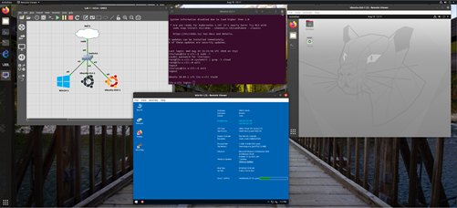

## ECT GNS3 Introduction - The Toolkit

### Goals
-   Configure Remote Desktop to connect to the lab environment
-   Learn the basic setup of the GNS3 virtual lab environment
-   Overview of Windows and Unix operating systems
-   Introduction to the CLI, and the interaction with filesystems
-   Become familiar with the Linux command line terminal (bash shell)

### Pre-Lab
- Homework/Labs/Projects will often have associated ECT Tech Nuggets that are recommended viewing after reading the lab the first time but before starting the work on the lab.  Do **NOT** follow along with the ECT Tech Nuggets while watching them for the first time. Watch the video and use what you have learned. - Windows is the only OS that is officially supported, but other OS's may be possible. 
<br>
- Watch the the following [ECT Tech Nuggets](https://www.youtube.com/@ecttechnuggets9126/featured) videos on YouTube:
    - GNS3 Introduction - [ECT Tech Nugget N1.1 GNS3](https://www.youtube.com/watch?v=w5qsM3LhpQI)
    - [ECT Tech Nugget - N34.0 - Technology Perspective](https://youtu.be/ixrzbdUu8yQ)
    - Remote Desktop Connection
        - Windows Users: [ECT Tech Nugget N14.1 RDC Connections](https://youtu.be/H52fC9hCmdk)
        - Apple Users: [ECT Tech Nugget N17.0 RDC and RD Gateway Apple Mac OSX](https://youtu.be/g1oYzEham8c)
        - RD Gateway IP/Hostname: ```its-s15.its.ohio.edu```

### Resources

- Personal Computer (Destkop or Laptop)
- A document you have created to use as a lab notebook
- Assigned gHost (GNS3 Virtual Machine)
- [ECT/ITS Lab Notebook Cheatsheet](https://github.com/OHIO-ECT/Lab-Notebook-Cheat-Sheet)
- Additional [ECT Tech Nuggets](https://www.youtube.com/@ecttechnuggets9126/featured):
  - [ECT Tech Nugget N0.1 Basic Diagnostic Tools 1](https://youtu.be/_pRXauSnU6U)
  - [ECT Tech Nugget N0.2 Basic Diagnostic Tools 2](https://youtu.be/hWeJlNVaUbU)
  - [ECT Tech Nugget N0.3 Basic Diagnostic Tools 3](https://youtu.be/PMk53TngTio)
  - [ECT Tech Nugget N0.4 Basic Diagnostic Tools 4](https://youtu.be/gD-Tk1Bk7x0)
  - [ECT Tech Nugget N0.5 Basic Diagnostic Tools 5](https://youtu.be/QTIbS9wyfag)
  - [ECT Tech Nugget N11.0 NMCLI](https://youtu.be/43F51qVz9Ds)

### Network Diagram


### Toolkit

-   Shells (i.e. Powershell, Bash)
-   SSH (i.e. Secure Shell)
-   Commands to be typed by the student and output from shells are indicated within this document in the ``fixed width font Courier New`` (as shown here).
-   Varibles to be filled in by the student are presented in ``<brackets>``. The student will need to replace the <> and the text with the needed varible. Example: **My name is ``<Name>``**. Would change to **My name is Bob.**
-   Find a Print Screen / Screen Capture tool that you like. The following is a list of tools known to work:
    -   Lightshot <https://app.prntscr.com>
    -   Greenshot <https://getgreenshot.org>

### Task 4 - Connecting Objects Inside GNS3

15. Review [ECT Tech Nugget N1.1 GNS3](https://www.youtube.com/watch?v=w5qsM3LhpQI)
<br>

16. Drag out and drop the appropreate icons as shown in the Network Diagram.
<br>

17.  Using the network diagram shown in this document connect all the GNS3 objects together. Review [ECT Tech Nugget N1.1 GNS3](https://www.youtube.com/watch?v=w5qsM3LhpQI) (scrub to about 6:20) for detailed instructions how to connect objects together in GNS3.
<br>

18. Please record, in your lab notebook, that GNS3 VMs inside GNS3 use the username `itsclass` and the password `class115#`. There is an ECT cheatsheet that 

### Task 5 - GNS3 Projects

19.  Start all objects in the project with the big green triangle.
<br>

20.  All the VMs will start at once. Get comfy as Atlas heaves the world up. The more objects in a project the longer this start up time will take. If you don't know who Atlas is you'll have some time to read [this](https://greekgodsandgoddesses.net/gods/atlas) while the all the GNS3 VMs (AKA child VMs) start up. Each child VM typicially starts a consol window so the user can see what's going on. 

        **Note:**  It is not always necessary (or desired) to start all objects at once. If needed, Right-Click the object for a context menu to control it individually.

21. Once all the GNS3 VMs have started and are either at a login prompt to a desktop GUI they are ready for use.
<br>

22. After starting up a project each GNS3 VM object will (typically) open a child console window (as shown in picture below). In this case should be three child windows inside gHost. First, Ubuntu-CLI-1 a Linux Server (terminal only), second is Ubuntu-GUI-1 a Linux Desktop (GUI with terminal option), third is Windows-Desktop-1. Operating systeming running inside operating systems (with windows inside windows) can be a very [Inception] idea. If this idea gives you a headache you are **doing it correctly**. Much of what we do as IT Professional is virtual. This type of environment is a very good example. For some help with this idea see [ECT Tech Nugget - N34.0 - Technology Perspective](https://youtu.be/ixrzbdUu8yQ.)

    - See [ECT Tech Nuggets Playlist](https://www.youtube.com/playlist?list=PLEA5GnkCPRTlvN_eyR99jOSsBCaV6khRS) for more detail. As always, if you have questions it's your responsibility to **ASK** for help! We can't know if you don't understand!

    

    Shown above GNS3 and GNS3 VMs - GNS3 Window (left), Ubuntu Linux Server (top center), Windows Desktop (bottom center), Ubuntu Linux Desktop/GUI (right).