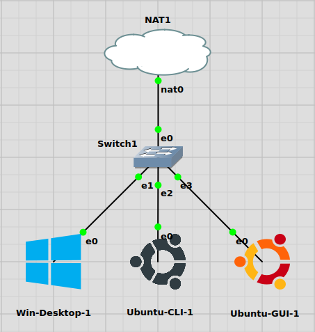

## ECT Lab Introduction - Basic Network Diagnostic Tools

### Goals
-   Configure Remote Desktop to connect to the lab environment
-   Learn the basic setup of the GNS3 virtual lab environment
-   Overview of Windows and Unix operating systems
-   Introduction to the CLI, and the interaction with filesystems
-   Become familiar with the Linux command line terminal (bash shell)

### Pre-Lab
- Homework/Labs/Projects will often have associated ECT Tech Nuggets that are recommended viewing after reading the lab the first time but before starting the work on the lab.  Do **NOT** follow along with the ECT Tech Nuggets while watching them for the first time. Watch the video and use what you have learned. - Windows is the only OS that is officially supported, but other OS's may be possible. 
<br>
- Watch the the following [ECT Tech Nuggets](https://www.youtube.com/@ecttechnuggets9126/featured) videos on YouTube:
    - GNS3 Introduction - [ECT Tech Nugget N1.1 GNS3]
    - [ECT Tech Nugget - N34.0 - Technology Perspective](https://youtu.be/ixrzbdUu8yQ)
    - Remote Desktop Connection
        - Windows Users: [ECT Tech Nugget N14.1 RDC Connections](https://youtu.be/H52fC9hCmdk)
        - Apple Users: [ECT Tech Nugget N17.0 RDC and RD Gateway Apple Mac OSX](https://youtu.be/g1oYzEham8c)
        - RD Gateway IP/Hostname: ```its-s15.its.ohio.edu```

### Resources

- Personal Computer (Destkop or Laptop)
- A document you have created to use as a lab notebook
- Assigned gHost (GNS3 Virtual Machine)
- [ECT/ITS Lab Notebook Cheatsheet](https://github.com/OHIO-ECT/Lab-Notebook-Cheat-Sheet)
- Additional [ECT Tech Nuggets](https://www.youtube.com/@ecttechnuggets9126/featured):
  - [ECT Tech Nugget N0.1 Basic Diagnostic Tools 1](https://youtu.be/_pRXauSnU6U)
  - [ECT Tech Nugget N0.2 Basic Diagnostic Tools 2](https://youtu.be/hWeJlNVaUbU)
  - [ECT Tech Nugget N0.3 Basic Diagnostic Tools 3](https://youtu.be/PMk53TngTio)
  - [ECT Tech Nugget N0.4 Basic Diagnostic Tools 4](https://youtu.be/gD-Tk1Bk7x0)
  - [ECT Tech Nugget N0.5 Basic Diagnostic Tools 5](https://youtu.be/QTIbS9wyfag)
  - [ECT Tech Nugget N11.0 NMCLI](https://youtu.be/43F51qVz9Ds)

### Network Diagram



### Toolkit

-   Shells (i.e. Powershell, Bash)
-   SSH (i.e. Secure Shell)
-   Commands to be typed by the student and output from shells are indicated within this document in the ``fixed width font Courier New`` (as shown here).
-   Varibles to be filled in by the student are presented in ``<brackets>``. The student will need to replace the <> and the text with the needed varible. Example: **My name is ``<Name>``**. Would change to **My name is Bob.**
-   Find a Print Screen / Screen Capture tool that you like. The following is a list of tools known to work:
    -   Lightshot <https://app.prntscr.com>
    -   Greenshot <https://getgreenshot.org>

### Task 8 - Basic Network Diagnostic Tools

Ping is a basic (the **MOST** basic) tool for figuring out if a machine has network access. The command will, in effect, bounce packets off the destination machine like a sonar.... PING. The command gives a binary answer: **YES** it sees something or **NO** it does not.

The **best** network debugging processes start with pinging another machine that is in the same IP network (more on that idea later) usually this is the default gateway.

Most implementations of ping will repeat the ping process several times; others will run continuously until user presses CTRL+C to stop the process.

The format of the ping command is `ping <destination>`. Where `<destination>` is replaced with either a hostname or IP. For example `ping google.com` or `ping 8.8.8.8`

39. Use the ping command on the specified machine to ping the following locations.
    -   Ubuntu-GUI-1: 132.235.1.1
    -   Windows-Desktop-1: 13.107.246.51
    -   Ubuntu-CLI-1: xkcd.com
<br>

40. Use the help command line flag (`-h` for Linux or `/?` for Windows) to find the properly flag to request 15 pings and then stop.
    -   Ubuntu-GUI-1: 99.83.183.221
    -   Windows-Desktop: www.kame.net

#### Traceroute Command

The traceroute command gives more detail about the network **BETWEEN** the machine and the destination.

The `-n` or `-d` option suppresses DNS hostname lookups on many commands. Typically, DNS names are not necessary for network diagnostics and consume time and create unwanted network traffic.

When an individual traceroute hit fails (lines noted with `* * *`) traceroute will typically continue until the test has reached 30 hops. Press Ctrl+C to stop it once if you get three or more lines with the `* * *` notation.

41. In gHost open terminal (aka CLI) and use the traceroute command.
Syntax: `traceroute -n <destination>`
Where `<destination>` is replaced with either a hostname or IP.
Example: `traceroute -n google.com`
<br>Traceroute to the following destinations:
    -   132.235.8.133
    -   www.ford.com
    -   8.8.8.8
    -   itsohio.net

42. In Windows-Desktop access the powershell terminal (aka CLI). Windows is limited to eight-character old-school commands (long story why) and uses a different switch to suppress DNS lookups. Access the Windows CLI and issue the command:
Syntax: `tracert -d <destination>`
Where `<destination>` is replaced with either a hostname or IP.
Example: `tracert -d google.com`
<br>Traceroute to the following destinations:
    -   8.8.4.4
    -   microsoft.com