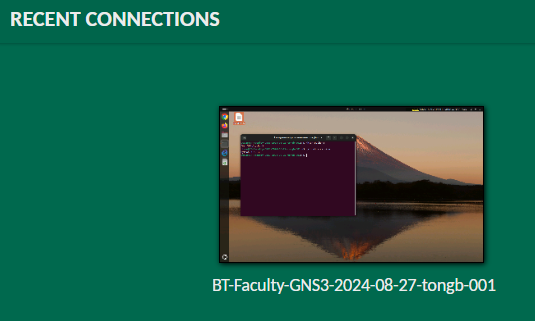
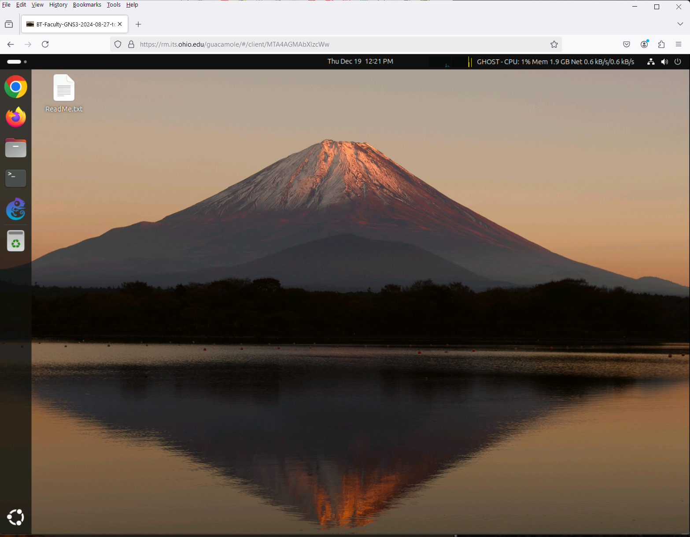
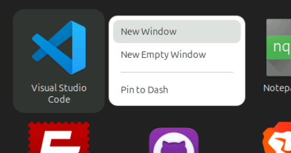
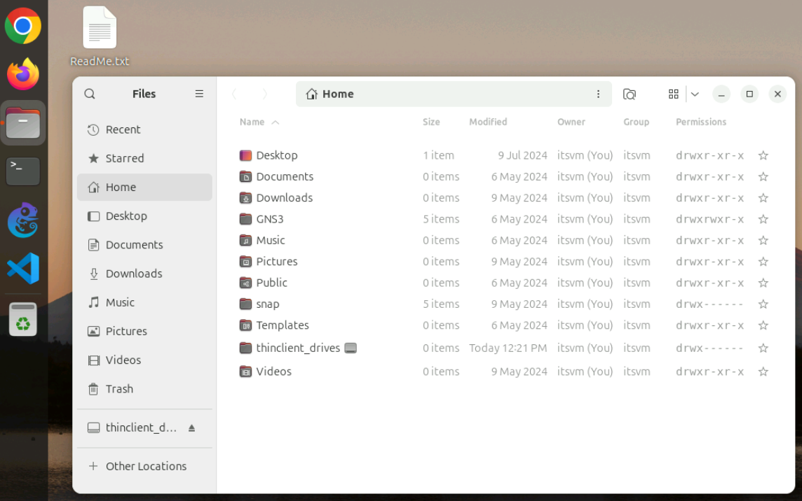

## Connect to GNS3 VM via a Web Browser (Guacamole Service) to a GUI.

### Goals
- Demonstrate how a student can connect to a Command Line Interface of their virtual host via a web-based method.
- Assigned gHost (GNS3 Virtual Machine)
- A document you have created to use as a lab notebook
- Tech Nuggets: [Tech Nuggets on YouTube](https://www.youtube.com/@ecttechnuggets9126)

### Connect to the Guacamole Service

Each student has been issued their own Linux Ubuntu Desktop Virtual Machine (VM). This system will be referred to as the "gHost" throughout the lab. The goal of this task is to show you how to connect to that environment so that you can work and complete assignments.

1. Retrieve the following information from either information presented in class, received via email, or perhaps found in canvas or other documentation related to the assignment. Ask faculty for assistance if needed.
 
    - GNS3 VM IP address
    - GNS3 VM Username
    - GNS3 VM Password
 

2. Watch the Pre-Lab video. **DO NOT follow along the first time.** Watch other Tech Nuggets as necessary to round out your understanding of related topics.
 

3. Connect to the Guacamole service from your own computer using your favorite browser. The URL is:
- https://rm.its.ohio.edu/
 

4. Login using your OHIO ID, Password, and your established method of Multifactor Authentication. If you are already logged into some other University service, single sign-on features will reuse the credentials and session already established. Once authenticated, you will see a screen similar to the following:

 

### Connect to your Virtual Machine's GUI

5. Locate and expand the "Class and Labs" caret (a little plus sign in a box) to reveal a list of the classes for which you have a VM.
 
It is possible to be in multiple classes each with their own VM. If so, it is important to use the right VM for the right class as they may have configuration differences and behind the scenes the VM environments are managed class-by-class. That is, don't use an ITS-2801 VM for ITS-2300, and vice-versa, even if it does work.
 

 

6. Note that if you have connected to Guacamole before the "Recent Connections" portion of the screen will present you with a quick way to reconnect as you had done before. You would just click on the connectio you desired. You won't see that the first time you connect, but it looks something like this:

 

7. Lower on the list of VMs for a specific class is another caret (plus sign) that you can expand to reveal SSH options. Click on that caret (plus sign). Each of your VMs will be listed with a >_ icon beside them. Click on that entry. This will log you into your VM and lead to a command line interface.

 

### A Tour of the GUI

8. The toolbar on the left of the screen has a number of useful icons. If you mouse-over them you can see the names of the applications they will launch. Find each of the following:

- Google Chrome
- Firefox
- Files
- Terminal
- GNS3
- Trash
- Show Apps

The last one is in the lower left corner, similar to where you might find the Windows icon on a Windows computer.
 

9. Some classes (ITS 2801) use the Visual Studio Code editor. If you are taking ITS 2801, click on the "Show Apps" icon. Find the "Visual Studio Code" icon, right-click on it, and choose "Pin to Dash" and it will be added to your toolbar. Once done, you can click on the "Show Apps" icon to make the list go away.

 

10. Launch the "Files" application from your toolbar by clicking on it. This is very similar to the Windows File Explorer or the Finder on the Macintosh. By default, it shows you the "Home" directory associated with your account. You can manage your files and directories (folder) using this application, though you can also do so via commands which is described in other Lab activities.

 

## Exfiltrating Data

11. The gHost machine has web access to the outside world. When saving data for lab reports there are several options. The easiest is to use a browser on the VM to access web-based email. Open the file named "README.txt" on the desktop, highlight the text found within, and copy it either by right-clicking on the highlighted text and choosing "copy" or via the CONTROL-C keys.
 

12. Back on your personal computer, open up any application that can receive text, such as Notepad or MS Word. Paste in the text that you copied from your VM. Notice that you can copy and paste from your VM to your personal computer, and vice-versa. You may find this to be handy in future assignments. You can close out the text application on your personal computer as we will not need it any more in this exercise.
 

13. Back on your VM, launch either the Chrome or Firefox browsers, login to your email service, compose a message to your OHIO ID, and attach the ReadMe.txt file to your message as an attachment. Send yourself the message. Then, on your personal computer, check your email and verify the attachment was included.
 

14. Back on your VM, point your browser to the Canvas LMS used by the class:
- https://canvas.ohio.edu
 

15. Note that you can use the LMS as normal and that you could turn in assignments directly from your VM, if needed.
 

