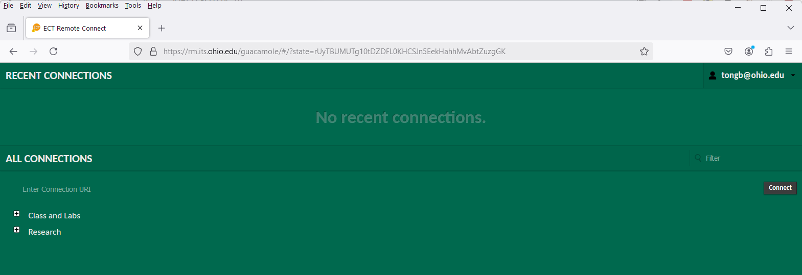
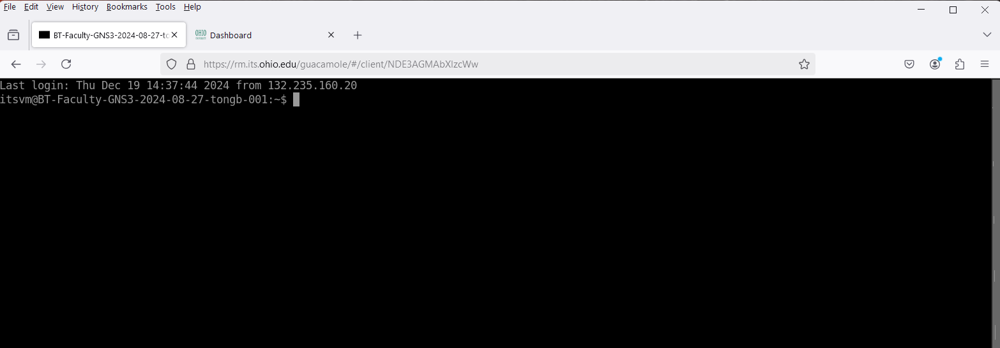

## Connect to GNS3 VM via a Web Browser (Guacamole Service) to a CLI

### Goals
- Demonstrate how a student can connect to a Command Line Interface of their virtual host via a web-based method.
- Assigned gHost (GNS3 Virtual Machine)
- A document you have created to use as a lab notebook
- Tech Nuggets: [Tech Nuggets on YouTube](https://www.youtube.com/@ecttechnuggets9126)

### Connect to the Guacamole Service

Each student has been issued their own Linux Ubuntu Desktop Virtual Machine (VM). This system will be referred to as the "gHost" throughout the lab. The goal of this task is to show you how to connect to that environment so that you can work and complete assignments.

1. Retrieve the following information from either information presented in class, received via email, or perhaps found in canvas or other documentation related to the assignment. Ask faculty for assistance if needed.
 
    - GNS3 VM IP address
    - GNS3 VM Username
    - GNS3 VM Password
 

2. Watch the Pre-Lab video. **DO NOT follow along the first time.** Watch other Tech Nuggets as necessary to round out your understanding of related topics.
 

3. Connect to the Guacamole service from your own computer using your favorite browser. The URL is:
- https://rm.its.ohio.edu/
 

4. Login using your OHIO ID, Password, and your established method of Multifactor Authentication. If you are already logged into some other University service, single sign-on features will reuse the credentials and session already established. Once authenticated, you will see a screen similar to the following:

 

### Connect to your Virtual Machine's CLI

5. Locate and expand the "Class and Labs" caret (a little plus sign in a box) to reveal a list of the classes for which you have a VM.
 
It is possible to be in multiple classes each with their own VM. If so, it is important to use the right VM for the right class as they may have configuration differences and behind the scenes the VM environments are managed class-by-class. That is, don't use an ITS-2801 VM for ITS-2300, and vice-versa, even if it does work.
 

 

6. Lower on the list of VMs for a specific class is another caret (plus sign) that you can expand to reveal SSH options. Click on that caret (plus sign). Each of your VMs will be listed with a >_ icon beside them.

 

7. Click on that entry. This will log you into your VM and lead to a command line interface.

 

### A Tour of the CLI

8. You are now at a Command Line interface to your VM. It is quite possible to develop applications in this environment, though you are more likely to do so in the GUI environment if you know your Linux commands.

You might be wondering why somebody might prefer to use a CLI. There are several reasons. First, professionally speaking, persons in certain specialties become very familiar with the available commands and can actually work faster in a command line environment. Secondly, computers running services that do not need a GUI can save a lot of resources by only offering a command line environment. Thirdly, when either a network or a host computer has lots of demand and is very busy a command line environment remains viable where a graphical environment becomes unusable.

In short, late in the semester when many classes are using the environment and some classes are doing some processor or I/O intensive operations, you may find the GUI to be laggy but the CLI to be fine. Keep your options open.

## Exfiltrating Data

In a CLI, you do not have a browser to use. While there are ways to copy files to other hosts via a command line, we're not going to cover that here.
