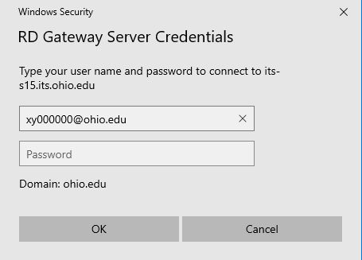

## Connect to GNS3 VM

### Goals
- Configure Remote Desktop to connect to the lab environment
- Learn the basic setup of the GNS3 virtual lab environment

### Pre-Lab
- Watch the the following [ECT Tech Nuggets](https://www.youtube.com/@ecttechnuggets9126/featured) videos on YouTube:
    - GNS3 Introduction - [ECT Tech Nugget N1.1 GNS3](https://www.youtube.com/watch?v=w5qsM3LhpQI)
    - [ECT Tech Nugget - N34.0 - Technology Perspective](https://youtu.be/ixrzbdUu8yQ)
    - Remote Desktop Connection - https://sites.google.com/site/ohioitslab/home/how-to/rd-gateway
        - Windows Users: [ECT Tech Nugget N14.1 RDC Connections](https://youtu.be/H52fC9hCmdk)
        - Apple Users: [ECT Tech Nugget N17.0 RDC and RD Gateway Apple Mac OSX](https://youtu.be/g1oYzEham8c)
        - RD Gateway IP/Hostname: ```its-s15.its.ohio.edu```

### Resources

- Personal Computer (Desktop or Laptop)
- A document you have created to use as a lab notebook
- Assigned gHost (GNS3 Virtual Machine)
- [ECT/ITS Lab Notebook Cheatsheet](https://github.com/OHIO-ECT/Lab-Notebook-Cheat-Sheet)
- [Windows RDP Client NON-Microsoft Store Version](./tasks/RDP-Setup_x64_v2.exe)

### Environmental Context
- Personal Computer with an RDP client installed (on Windows it comes pre-installed)

### Connect to GNS3 VM

Each student has been issued their own Linux Ubuntu Desktop Virtual Machine (VM) with GNS3 installed upon it. This system will be referred to as the "gHost" throughout the lab. 

1. Retrieve the following information from Blackboard. Ask faculty for assistance if needed.
    - GNS3 VM IP address
    - GNS3 VM Username
    - GNS3 VM Password
<br>

2. **DO NOT follow along the first time.** Watch the [ECT Tech Nugget N14.1 RDC Connections](https://youtu.be/H52fC9hCmdk) and other pre-lab videos for procedures to connect to your gHost (AKA GNS3 VM).
    - RD Gateway IP/Hostname: `its-s15.its.ohio.edu`
<br>

3. After following the directions in the YouTube tutorial to configure the RD Gateway. A series of logins is required to finally connect to the gHost. The first login (using the itsvm username/password) is used here in the Remote Desktop Connection Client (AKA RDC Client or RDP Client). 


4. The second login prompt will appear after clicking on the "Connect" button. Read the dialog box carefully. If the dialog is asking for "RD Gateway Server Credentials" use your OHIO ID and password. See below for an example.


## Exfiltrating Data

5. The gHost machine has web access to the outside world. When saving data for lab reports there are several options. The easiest is to use the browser on the gHost machine to access web-based email. Open the file named "README.txt" on the desktop. Email the contents (i.e. copy/paste text content of the file to an email) to your OHIO ID.
<br>

6. It is also possible to copy/paste text data from the gHost. Copy ``Fine Art Indeed`` from this document and paste it into the README file on the gHost desktop.
