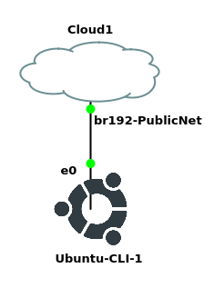

# GNS3 Projects

## Goals
- Deploy an Ubuntu Server in GNS3.

## Resources
- Personal Computer (Desktop or Laptop)
- A document you have created to use as a lab notebook
- Assigned gHost (GNS3 Virtual Machine)
- [ECT/ITS Lab Notebook Cheatsheet](https://github.com/OHIO-ECT/Lab-Notebook-Cheat-Sheet)
- [ECT Tech Nuggets Playlist](https://www.youtube.com/playlist?list=PLEA5GnkCPRTlvN_eyR99jOSsBCaV6khRS)
- [GNS3 GUI Documentation](https://docs.gns3.com/docs/using-gns3/beginners/the-gns3-gui)
- [ECT Tech Nugget N1.1 GNS3](https://www.youtube.com/watch?v=w5qsM3LhpQI)

## Environmental Context
- Connection to gHost VM

## Deploy the Ubuntu GUI

1. Start the GNS3 application with gecko icon in the right hand navigation.

2. Use the "New Blank Project" button from the GNS3 toolbar. The interface that appears has two tabs. The first allow the user to create a new blank project and the second provides a list of projects from this computer "Project Library".

3. Expand the "All Devices" menu from the "Devices Toolbar" on the left hand side of GNS3.

4. Using the network diagram shown in this document connect all the GNS3 objects together. 



5. Once all the GNS3 VM has started and is at a login prompt it is ready to use. Use the standard username `itsclass` and the password `class115#` to log into the server.

6. Projects remain running even if the user is NOT connected to the remote desktop connection. This allows the student to break from the lab work and return to the project later.  Lets this project running unless instructed otherwise.

## Configure the network

7. Using knowledge from ITS 2300 and the [ECT/ITS Lab Notebook Cheatsheet](https://github.com/OHIO-ECT/Lab-Notebook-Cheat-Sheet) to configure the "Wired connection 1" with the IPv4 and IPv6 addresses show in the Network Information page in Canvas.

8. Show that the server can ping google via IPv4 and IPv6.

```ping -4 google.com```
```ping -6 google.com```